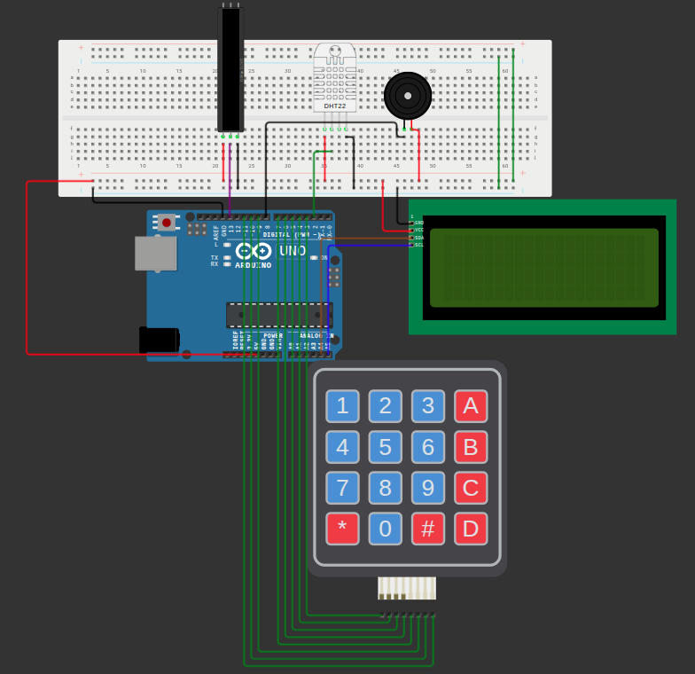

# 🌎 Eco Fusion - Monitoramento Inteligente de Risco de Queimadas

## 📌 Sobre o Projeto

O **Eco Fusion** é uma solução desenvolvida para auxiliar na prevenção e monitoramento de queimadas por meio da integração entre **dados ambientais locais** e informações obtidas por satélites.

Este protótipo representa a camada **Edge Computing** do projeto, realizando medições instantâneas diretamente no ambiente utilizando sensores embarcados.

Através de um sensor DHT22, o sistema monitora temperatura e umidade do ar em tempo real, calcula o risco de queimadas e avalia se as condições atuais estão adequadas para uma planta configurada pelo usuário.

---

## 🎯 Objetivos

* Monitorar temperatura ambiente em tempo real;
* Monitorar umidade relativa do ar;
* Calcular o risco local de queimadas;
* Permitir a configuração dos limites ideais de uma planta;
* Informar se a planta está em condições adequadas;
* Exibir informações em um display LCD;
* Fornecer alertas visuais através de uma barra NeoPixel;
* Emitir alertas sonoros em situações críticas;
* Integrar a coleta local de dados ao ecossistema Eco Fusion.

---

## 🛰️ Eco Fusion

O projeto completo Eco Fusion combina:

### Dados de Satélite

* Focos de calor;
* Áreas queimadas;
* Condições climáticas;
* Monitoramento territorial.

Fontes planejadas:

* NASA
* ESA
* Copernicus
* INPE

### Dados Locais (Este Protótipo)

* Temperatura ambiente;
* Umidade relativa do ar;
* Condições ideais para cultivo;
* Avaliação instantânea de risco.

---

## 🔗 Simulação no Wokwi

Adicione aqui o link atualizado do projeto.

```
[Simulação Wokiwi](https://wokwi.com/projects/465662515143762945)
```

---

## 📷 Circuito



---

# 🛠️ Componentes Utilizados

| Componente              | Quantidade |
| ----------------------- | ---------- |
| Arduino UNO             | 1          |
| Sensor DHT22            | 1          |
| Display LCD I2C 20x4    | 1          |
| Teclado Matricial 4x4   | 1          |
| Barra NeoPixel (7 LEDs) | 1          |
| Buzzer                  | 1          |
| Protoboard              | 1          |
| Jumpers                 | Diversos   |

---

# 📦 Bibliotecas Utilizadas

```cpp
#include <Wire.h>
#include <LiquidCrystal_I2C.h>
#include <DHT.h>
#include <Adafruit_NeoPixel.h>
#include <Keypad.h>
```

Bibliotecas necessárias:

* DHT Sensor Library
* LiquidCrystal I2C
* Adafruit NeoPixel
* Keypad

---

# ⚙️ Funcionamento

## 1️⃣ Configuração Inicial

Ao iniciar o sistema, o usuário define:

* Temperatura mínima ideal;
* Temperatura máxima ideal;
* Umidade mínima ideal;
* Umidade máxima ideal.

Esses valores representam as condições desejadas para determinada planta.

---

## 2️⃣ Coleta dos Dados

O sensor DHT22 realiza leituras contínuas de:

* Temperatura (°C)
* Umidade (%)

---

## 3️⃣ Avaliação da Planta

O sistema compara os dados atuais com os limites definidos.

### Temperatura

* Abaixo do mínimo → Temperatura Baixa
* Acima do máximo → Temperatura Alta
* Entre os limites → Temperatura Ideal

### Umidade

* Abaixo do mínimo → Umidade Baixa
* Acima do máximo → Umidade Alta
* Entre os limites → Umidade Ideal

---

## 4️⃣ Cálculo do Risco de Queimada

O risco é calculado por um sistema de pontuação.

### Temperatura

| Temperatura | Pontos |
| ----------- | ------ |
| < 20°C      | 0      |
| ≥ 20°C      | 1      |
| ≥ 25°C      | 2      |
| ≥ 30°C      | 3      |
| ≥ 35°C      | 4      |
| ≥ 40°C      | 5      |

### Umidade

| Umidade | Pontos |
| ------- | ------ |
| > 60%   | 0      |
| ≤ 60%   | 1      |
| ≤ 50%   | 2      |
| ≤ 40%   | 3      |
| ≤ 30%   | 4      |
| ≤ 25%   | 5      |

---

## Classificação

| Pontuação | Risco   |
| --------- | ------- |
| 0 - 2     | BAIXO   |
| 3 - 4     | MÉDIO   |
| 5 - 6     | ALTO    |
| 7 - 10    | CRÍTICO |

---

# 🌈 Barra NeoPixel

A barra possui 7 LEDs que representam o risco calculado.

### Faixa Verde

LEDs 1 e 2

* Situação segura

### Faixa Amarela

LEDs 3 e 4

* Atenção

### Faixa Vermelha

LEDs 5, 6 e 7

* Alto risco

### Situação Crítica

Quando o risco é crítico:

* Todos os LEDs necessários permanecem vermelhos;
* A barra passa a piscar.

---

# 🔔 Sistema de Alerta

Quando o risco é classificado como **CRÍTICO**:

* O buzzer é acionado;
* Um ícone de fogo aparece no display;
* A barra NeoPixel pisca continuamente.

### Silenciar Alarme

Tecla:

```text
D
```

---

# ⌨️ Controles do Teclado

| Tecla | Função                 |
| ----- | ---------------------- |
| 0-9   | Inserir números        |
| *     | Inserir ponto decimal  |
| #     | Confirmar valor        |
| A     | Apagar último dígito   |
| B     | Reiniciar configuração |
| D     | Silenciar buzzer       |

---

# 🖥️ Informações Exibidas no LCD

O sistema alterna automaticamente entre duas telas.

## Tela 1 – Risco de Queimada

```text
Temperatura: 30.5°C
Umidade: 45%

Risco Queimada:
ALTO
```

---

## Tela 2 – Saúde da Planta

```text
Temperatura: 30.5°C
Umidade: 45%

Planta:
Temp Ideal
Umidade Baixa
```

---

# 🧠 Conceitos Aplicados

* Edge Computing
* Sistemas Embarcados
* Arduino
* Sensoriamento Ambiental
* Agricultura Inteligente
* Monitoramento Climático
* Prevenção de Queimadas

---

# 🚀 Como Executar

1. Monte o circuito;
2. Instale as bibliotecas necessárias;
3. Faça upload do código;
4. Configure os limites da planta utilizando o teclado;
5. Observe as leituras em tempo real;
6. Analise o risco de queimadas e as condições da planta.

---

# 📂 Estrutura do Projeto

```plaintext
EcoFusion-EdgeComputing
│
├── script.ino
├── README.md
└── image.png
```

---

# 👥 Equipe

* Luiz Alberto De Carvalho Holanda Junior
* Felipe Ribeiro Da Silva
* Milena Kubo de Biaggi
* Yasmim Eun Hae Kim

---

# 📄 Licença

Projeto acadêmico desenvolvido para a disciplina de Edge Computing & Computer Systems – FIAP.

