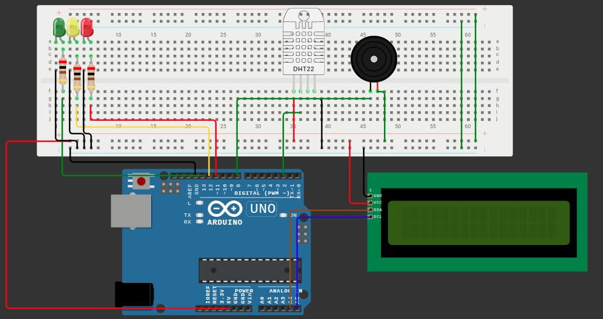

# Global Solution - Edge Computing

🔥 Sistema Inteligente de Monitoramento de Risco de Queimadas

## 📌 Descrição do Projeto

Este projeto foi desenvolvido com o objetivo de monitorar condições ambientais associadas ao risco de queimadas.

O sistema utiliza um sensor DHT22 para realizar leituras de temperatura e umidade do ar. Com base nesses dados, um algoritmo de pontuação calcula o nível de risco de ocorrência e propagação de incêndios.

As informações são exibidas em um display LCD I2C, enquanto LEDs e um buzzer fornecem alertas visuais e sonoros para situações de maior risco.

---

## 🎯 Objetivos

* Monitorar a temperatura do ambiente;
* Monitorar a umidade relativa do ar;
* Classificar o risco de queimadas em diferentes níveis;
* Exibir informações em um display LCD I2C;
* Utilizar LEDs para indicar visualmente o nível de risco;
* Acionar um buzzer em situações críticas;
* Demonstrar conceitos de monitoramento ambiental utilizando Arduino.

---

## 🔗 Link do Projeto (Wokwi)

[https://wokwi.com/projects/465662515143762945](https://wokwi.com/projects/465662515143762945)

---

## 📷 Simulação



---

## 🛠️ Componentes Utilizados

* Arduino UNO;
* Sensor DHT22;
* Display LCD I2C 16x2;
* LEDs:

  * 🟢 Verde;
  * 🟡 Amarelo;
  * 🔴 Vermelho;
* Resistores;
* Buzzer;
* Protoboard;
* Jumpers.

---

## 📦 Dependências

Bibliotecas utilizadas no projeto:

* `Wire.h`
* `LiquidCrystal_I2C.h`
* `DHT.h`

Bibliotecas que devem ser instaladas na IDE Arduino:

* DHT Sensor Library
* LiquidCrystal I2C

---

## ⚙️ Funcionamento do Sistema

O sistema realiza leituras contínuas de:

* Temperatura (°C);
* Umidade Relativa (%).

Cada variável recebe uma pontuação conforme as condições ambientais observadas.

A soma dessas pontuações determina o nível de risco:

* Baixo;
* Médio;
* Alto;
* Crítico.

O resultado é exibido no display LCD e indicado por LEDs e buzzer.

---

## 🧮 Sistema de Pontuação

### Temperatura

| Temperatura | Pontos |
| ----------- | ------ |
| < 20°C      | 0      |
| ≥ 20°C      | 1      |
| ≥ 25°C      | 2      |
| ≥ 30°C      | 3      |
| ≥ 35°C      | 4      |
| ≥ 40°C      | 5      |

### Umidade

| Umidade | Pontos |
| ------- | ------ |
| > 60%   | 0      |
| ≤ 60%   | 1      |
| ≤ 50%   | 2      |
| ≤ 40%   | 3      |
| ≤ 30%   | 4      |
| ≤ 25%   | 5      |

### Cálculo do Risco

```text
Pontos Temperatura + Pontos Umidade = Risco Total
```

| Risco Total | Nível   |
| ----------- | ------- |
| 0 - 2       | BAIXO   |
| 3 - 4       | MÉDIO   |
| 5 - 6       | ALTO    |
| 7 - 10      | CRÍTICO |

---

## 💡 Regras de Funcionamento

### 🟢 LED Verde

Acende quando:

* O risco é classificado como BAIXO.

---

### 🟡 LED Amarelo

Acende quando:

* O risco é classificado como MÉDIO.

---

### 🔴 LED Vermelho

Acende quando:

* O risco é classificado como ALTO;
* O risco é classificado como CRÍTICO.

---

### 🔔 Buzzer

Permanece ligado quando:

* O risco é classificado como CRÍTICO.

---

### 🔥 Indicador de Incêndio

Quando o risco atinge o nível CRÍTICO:

* Um ícone de fogo personalizado é exibido no LCD;
* O ícone pisca continuamente para chamar atenção do usuário.

---

## 🖥️ Informações Exibidas no LCD

### Primeira Linha

```text
T:30.5°C U:45%
```

Exibe:

* Temperatura atual;
* Umidade atual.

---

### Segunda Linha

```text
Risco:ALTO
```

ou

```text
Risco:CRITICO 🔥
```

Exibe:

* Classificação do risco;
* Ícone de fogo piscante em situações críticas.

---

## 🔌 Ligações do Circuito

### Sensor DHT22

| Pino DHT22 | Arduino |
| ---------- | ------- |
| VCC        | 5V      |
| DATA       | D2      |
| GND        | GND     |

---

### Display LCD I2C

| LCD I2C | Arduino UNO |
| ------- | ----------- |
| SDA     | A4          |
| SCL     | A5          |
| VCC     | 5V          |
| GND     | GND         |

---

### LEDs

| LED      | Pino |
| -------- | ---- |
| Verde    | 13   |
| Amarelo  | 12   |
| Vermelho | 11   |

---

### Buzzer

| Componente | Pino |
| ---------- | ---- |
| Buzzer     | 8    |

---

## 🧠 Conceitos Utilizados

* Sistemas embarcados;
* Sensores digitais;
* Monitoramento ambiental;
* Análise de risco;
* Arduino;
* Display LCD I2C;
* Caracteres personalizados em LCD;
* Alertas visuais e sonoros;
* Internet das Coisas (IoT).

---

## 🚀 Como Executar

1. Monte o circuito no Wokwi ou em uma protoboard;
2. Instale as bibliotecas:

   * DHT Sensor Library;
   * LiquidCrystal I2C;
3. Faça upload do código para o Arduino;
4. Execute a simulação;
5. Altere os valores de temperatura e umidade do DHT22;
6. Observe:

   * Mudança dos LEDs;
   * Acionamento do buzzer;
   * Atualização do LCD;
   * Ícone de fogo em situações críticas.

---

## 📷 Simulação

Utilize a imagem do circuito utilizada no projeto.

---

## 📚 Estrutura do Projeto

```plaintext
Projeto-Monitoramento-Queimadas
│
├── sketch.ino
├── README.md
├── image.png
└── video-demo.mp4
```

---

## 📄 Licença

Projeto acadêmico desenvolvido para a disciplina de Edge Computing & Computer Systems - FIAP.

---

## 👥 Equipe

* Luiz Alberto De Carvalho Holanda Junior
* Felipe Ribeiro Da Silva
* Milena Kubo de Biaggi
* Yasmim Eun Hae Kim

---

### Exemplo de Funcionamento

| Temperatura | Umidade | Pontuação | Resultado |
| ----------- | ------- | --------- | --------- |
| 22°C        | 70%     | 1         | BAIXO     |
| 30°C        | 60%     | 4         | MÉDIO     |
| 30°C        | 30%     | 7         | CRÍTICO   |
| 35°C        | 30%     | 8         | CRÍTICO   |
| 40°C        | 25%     | 10        | CRÍTICO   |

**Observação:** os limites utilizados representam uma simplificação acadêmica para fins de demonstração do conceito de monitoramento de risco de queimadas.
